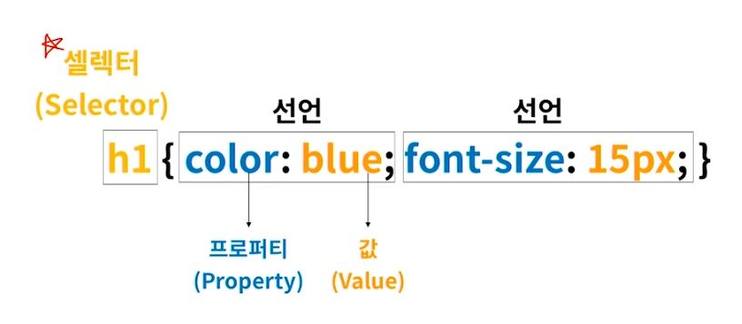
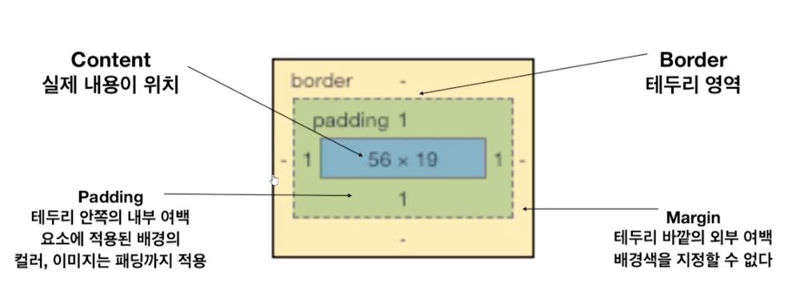
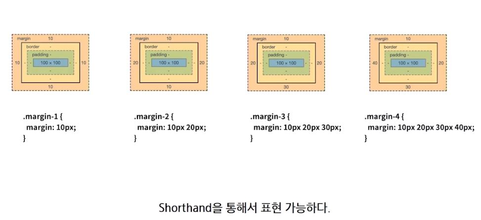

# CSS

- Cascading Style Sheets

- HTML은 문서의 구조화, CSS는 스타일 정의


## CSS 기본 사용법

- 셀렉터:star:




## CSS 정의 방법

- 인라인 (해당 태그 내에 <style> 태그 지정)
- 내부 참조 (HTML 파일 내에 <style> 태그에 지정)
- 외부 참조 (외부 CSS 파일을 <head> 태그 내 <link> 태그를 통해 불러오기)


## CSS Selector

### 선택자

- HTML 문서에 특정한 요소를 선택하여 스타일링 하기 위해서는 반드시 선택자라는 개념이 필요하다

- 기초 선택자

- 고급 선택자

  - 자손 선택자, 직계 자손 선택자
  - 형제, 인접 형제 선택자, 전체 선택자

- 의사 클래스 (pseudo class) -> 있다는 정도만

  - 링크, 동적 의사 클래스
  - 구조적 의사 클래스
  - 기타 의사 클래스, 의사 엘리먼트, 속성 선택자

  

### CSS 상속

- CSS는 상속을 통해 부모 요소의 속성을 자식에게 상속한다
  - 속성 중에는 상속이 되는 것과 되지 않는 것들이 있다.
  - 상속 되는 것
    - ex) Text 관련 요소 (font, color, text-align), opacity, visibility 등
  - 상속 되지 않은 것
    - ex) Box model 관련 요소 (width, height, margin, padding, border, box-sizing, display), position 관련 요소(position, top/right/bottom/left,z-index) 등
- MDN에서 확인하기


### CSS 적용 우선순위 (casading order) :star2:

- CSS 우선 순위를 아래와 같이 그룹을 지어 볼 수 있다.
  - 중요도
    - !important
  -  우선순위 
    - 인라인 / id 선택자 / class 선택자 / 요소 선택자
  - 소스 순서


## 기초 CSS


### 크기 단위 (상대)

- px (픽셀)
- %
- em : 배수단위, 요소에 지정된 사이즈에 상대적인 사이즈를 가짐.
- rem : 최상위 요소(html)의 사이즈를 기준으로 배수 단위를 가짐 -> root(최상위) em이라고 보면 된다
- Viewport 기준 단위
  -  vw, vh, vmin, vmax


### 색상 단위

- HEX(00~ff)
  - **#fffff**
- RGB(0, 255)
  - **rgb(0, 0, 0)**
- RGBA
  - **rgba(0, 0, 0, 0.5)**


### CSS 문서표현

- 텍스트
  - 변형 서체 -> \<strong>, \<em> 
  - 자간, 단어 간격, 행간, 들여쓰기
  - 기타 꾸미기
- 컬러, 배경(background-image, background-color)
- 목록 꾸미기
- 표 꾸미기


## Box model


### Box model 구성




- margin/padding




### box-sizing

- 기본적으로 모든 요소의 `box-sizing`은 `content-box`
  - padding을 제외한 순수 contents 영역만을 box로 지정
- 다만, 우리가 일반적으로 영역을 볼 때는 border까지를 너비로 보는 것을 원함.
  - 그 경우 `box-sizing`을 `border-box`


### 마진 상쇄 (Margin collapsing)

- 인접 형제 요소 간의 margin이 겹처서 보임

  - ```html
    <div class='mb-1'>
        1    
    </div>
    <div class='mt-3'>
        2
    </div>
    
    두개는 각각 마진이 아래로 1rem, 위로 3rem이여서 일반적으로 생각할 때는 총 마진이 4rem이 되어야 하는데 마진 상쇄로 인해 3rem이 된다.
    ```


## Display 속성


### 블록 레벨 요소와 인라인 레벨 요소

- 블록 레벨 요소와 인라인 레벨 요소 구분 (HTML 4.1까지)
- 대표적인 블록 레벨 요소
  - div / ul, ol, li / p / hr / form 등

- 대표적인 인라인 레벨 요소
  - span / a / img / input, label / b, em, i, strong 등


### display

- `display`: `block`
  - 줄 바꿈이 일어나는 요소
  - 화면 크기 전체의 가로폭을 차지한다.
  - 블록 레벨 요소 안에 인라인 레벨 요소가 들어갈 수 있음.
  - 너비를 가질 수 없다면 margin을 자동으로 준다. 


- `display`: `inline`
  - 줄 바꿈이 일어나지 않는 행의 일부 요소
  - content 너비만큼 가로폭을 차지한다
  - width, height, margin-top, margin-bottom 을 지정할 수 없다.
  - 상하여백은 line-height로 지정한다.


- `display` : `inline-block`
  - block과 inline 레벨 요소의 특징을 모두 갖는다.
  - inline처럼 한 줄에 표시 가능하며, block 처럼 width, height, margin 속성을 모두 지정할 수 있다. 


## CSS 심화


### CSS position


- static : 디폴트 값 (기준 위치)
  - 기본적인 요소의 배치 순서에 따름 (좌측 상단)
  - 부모 요소 내에서 배치될 때는 부모 요소의 위치를 기준으로 배치된다.
- 아래는 좌표 프로퍼티 (top, bottom, left, right)를 사용하여 이동이 가능하다. (음수값도 가능)
  - relative (상대위치) : static 위치를 기준으로 이동
  - absolute (절대 위치)  : static이 아닌 가장 가까이 있는 부모/조상 요소를 기준으로 이동 (집을 나간다, 주변 요소들의 레이아웃까지 깨짐)
  - fixed (절대 위치) : 부모 요소와 관계 없이 브라우저를 기준으로 이동
    - 스크롤시에도 항상 같은 곳에 위치


## CSS float


### CSS float 속성

- Float은 요소를 일반적인 흐름에서 벗어나도록 하는 속성 중 하나
  - 반드시 clear 속성을 통해 초기화가 필요하며, 예상치 못한 상황이 발생할 수 있암.
- float을 사용하는 경우 block 사용을 뜻하며, display 값이 inline인 경우 block으로 계산


### Float가 발생 시키는 문제

- 자식 요소의 float 속성으로 인해 부모 영역의 높이가 사라지는 문제
- clear 한 요소의 margin이 제대로 표현이 되지 않는 문제


###  Float가 발생 시키는 문제 - 해결방안

- 다양한 해결 방안들이 있으나, 가장 많이 활용되고 문제가 없는 의사 (가상) 요소 선택자를 활욯한 방법

  - ```css
    .clearfix::after {
        content: "";
        display: block;
        clear: both;
    }
    
    부모 요소에 clearfix 클래스를 추가해주어 해결
    ```


## CSS Layout


### HTML/CSS의 기본 특징

- 일반적으로 HTML 요소들은 문서의 위에서부터 아래로 순차적으로 나열된다.
- 아래의 방법들을 통해 변경될 수 있다.
  - display 속성을 통해 요소가 보여지는 방식 변경
    - block, inline, inline-block
    - table, flexible box, grid 등의 레이아웃을 활용
  - position 속성을 통해 위치 자체를 변경
  - float 속성을 통해 떠 있도록 만듬


### CSS를 어렵게 만드는 요소

- 일반적인 흐름 (Normal flow)을 바꿔버리는 경우!
- Normal flow
  - inline block, relative position
- Floats
- Absolute positioning