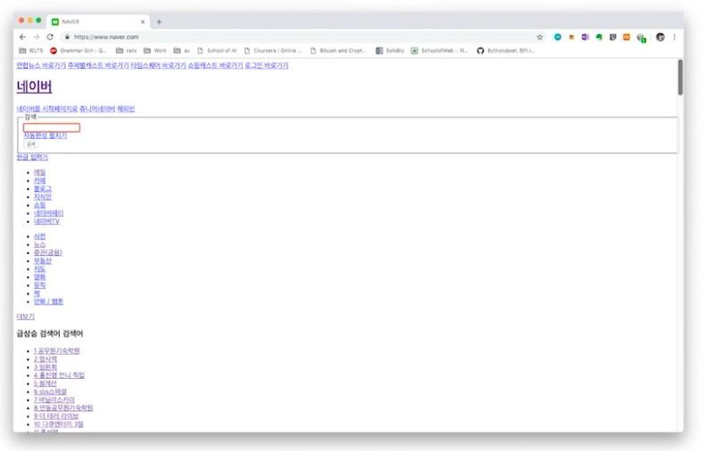
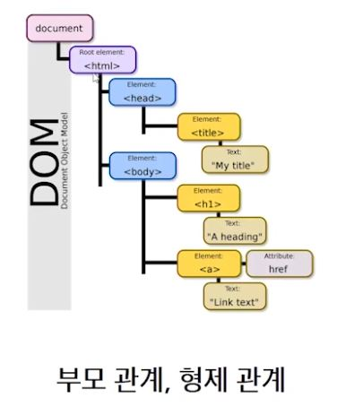
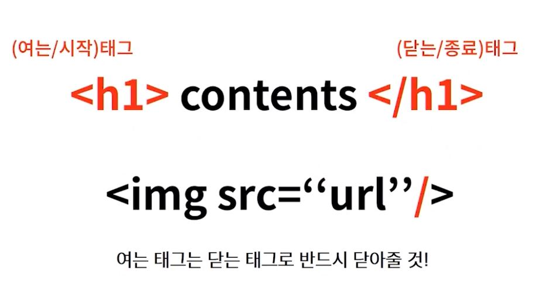

# HTML이란

- **Hyper Text Markup Language**
- 문서의 구조를 잡기 위한 것

  

### Hyper Text

- 각 문서 내부마다 다른 문서로 연결되는 링크들을 가지고 있는 형태

  

- Hyper Text를 주고 받는 규칙 -> **HTTP**

### Markup

- 문서의 구조를 잡는 작업

  

# HTML 기본 구조

### DOM (Document Object Model) 트리

### 요소 (element)

### head

- 문서 제목, 문자 인코딩 등의 문서 정보를 담고 있음.
- **메타데이터**를 통해 웹 문서에 대한 추가 정보를 선언
  - 메타 데이터를 표현하는 새로운 규약, **Open Graph Protocol**:star:
    - HTML 문서의 메타 데이터를 통해 문서의 정보를 전달
    - 페이스북에서 만들었으며, 메타정보에 해당하는 제목,설명 등을 쓸 수 있도록 정의
    
      
- 외부 파일 연결
  
  - CSS 파일 혹은 자바스크립트 파일

### Sementic tag :star:

- HTML5에서 의미론적 요소를 담은 태그의 등장. ~~div~~
- 대표적인 태그
  - header : 문서 전체나 섹션의 헤더(머릿말 부분)
  - nav : 내비게이션
  - aside : 사이드에 위치한 공간, 메인 콘텐츠와 관련성이 적은 콘텐츠
  - section : 문서의 일반적인 구분, 컨텐츠의 그룹을 표현
  - article : 문서, 페이지, 사이트 안에서 독립적으로 구분되는 영역
  - footer : 문서 전체나 섹션의 푸터 (마지막 부분)
- 개발자 및 사용자 뿐만 아니라 검색엔진 등에 의미 있는 정보의 그룹을 태그로 표현
- 단순히 구역을 나누는 것 뿐만 아니라 의미를 가지는 태그들을 활용하기 위한 노력
- Non semantic 요소는 div, span 등이 있으며, h1, table 도 시맨틱 태그로 볼수 있음
- 검색엔진최적화(SEO)를 위하여는 메타 태그, 시맨틱태그 등을 통한 마크업을 효과적으로 할 필요가 있다.

## HTML 문서 구조화

### 그룹 컨텐츠

- p
- hr
- 목록 ol, ul
- pre, blockquote

- figure, div

### 텍스트 관련 요소

- a
- b(볼드체) vs strong(강조)
- i(이탤릭체) vs em(강조)
- span, br, img 등등

### table

- tr, td, th
- thead, tbody, tfoot
- caption
- 셀 병합 속성 : colspan, rowspan

- scope 속성
- col, colgroup

### form

### input

## HTML/CSS 코드 작성을 위한 VS Code 추천 패키지

- HTML Snippets(3.9M), HTML CSS Support (4.2M)
- Open in browser(1.7M)
- Auto rename tag(4.1M), Auto close tag(3.8M)

 ## 웹 사이트 분석 - web developer

